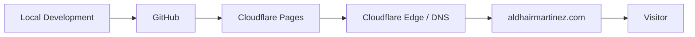
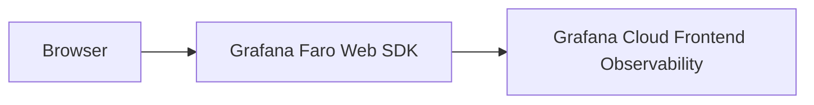

# aldhairmartinez.com

My personal technical portfolio — and, alongside that, an evolving hands-on observability and development lab. It started as a static Next.js site and is meant to grow, piece by piece, into a fully observed application, with each addition built and verified for real rather than described in advance.

**Live at [aldhairmartinez.com](https://aldhairmartinez.com).**

## What this is

- **A portfolio.** Projects, writing, career history, and a resume for Aldhair Martinez, a Solutions Engineer working across observability, cloud infrastructure, DevOps/SRE, developer tooling, and AI.
- **A working lab.** The site itself is the first entry in [`/projects`](https://aldhairmartinez.com/projects/this-website) — production infrastructure and real telemetry, not a mockup of either.

See [`/observability`](https://aldhairmartinez.com/observability) for a living breakdown of what's implemented today versus planned.

## V1 architecture

- **[Next.js](https://nextjs.org/)** (App Router) + **React** + **TypeScript** + **[Tailwind CSS](https://tailwindcss.com/)** (v4, CSS-first config)
- **Static export** (`output: 'export'`) — every route is pre-rendered at build time to plain HTML/CSS/JS; there is no server process and no backend
- **[Cloudflare Pages](https://pages.cloudflare.com/)** for hosting and CI/CD — builds and deploys automatically on every push to `main`
- **Cloudflare DNS + HTTPS** — the production site is served at [https://aldhairmartinez.com](https://aldhairmartinez.com)
- **[Grafana Faro](https://grafana.com/oss/faro/)** — frontend instrumentation, sending real browser telemetry from production to **Grafana Cloud Frontend Observability**
- **MDX-based content** (frontmatter + Markdown) for projects and writing, parsed at build time — no CMS, no database

### Deployment flow



### Observability flow



## Development

```bash
npm install
npm run dev     # http://localhost:3000
npm run lint
npm run build    # static export → ./out
```

## Environment configuration

Three variables configure Faro:

- `NEXT_PUBLIC_FARO_URL`
- `NEXT_PUBLIC_FARO_APP_NAME`
- `NEXT_PUBLIC_FARO_ENVIRONMENT`

`.env.example` documents every variable the project uses (with placeholder values only) and is committed to Git. `.env.local` holds real local values and is gitignored — it's never committed. Production values are configured directly in the Cloudflare Pages project settings, not in any file in this repository. No collector URLs, credentials, or tokens are ever committed or documented in this README.

## Observability

V1 is instrumented with Grafana Faro, sending real browser telemetry from **production** to Grafana Cloud Frontend Observability. The instrumentation is configured to collect page loads/navigation, frontend (JavaScript) errors, Web Vitals, browser/resource performance timing, and session data.

Production verification showed page loads for `/` and `/observability`, with TTFB, FCP, LCP, and CLS reported, and zero JavaScript errors in that initial sample. That confirms the pipeline works end to end — it's not a performance benchmark, and the sample is far too small to draw any performance conclusions from.

Session Replay and distributed tracing are **not** implemented — see below.

## Current vs. planned

**Current (live today):**
- Static Next.js frontend, no backend
- Cloudflare Pages deployment, custom domain, HTTPS
- Grafana Faro → Grafana Cloud Frontend Observability, live in production

**Planned:**
- Python/FastAPI backend
- OpenTelemetry + distributed tracing
- PostgreSQL, Redis, Kafka
- Docker, Kubernetes
- AWS infrastructure
- Grafana Faro Session Replay
- Synthetic monitoring
- k6 load testing

Nothing in the "planned" list exists yet. [`/observability`](https://aldhairmartinez.com/observability) tracks the same distinction live, kept in sync with the code.

## Repository philosophy

This project evolves incrementally: **build → deploy → observe → document → expand.** Each piece ships as a real, verified addition — instrumented and confirmed working — before the next one starts, rather than being architected in full up front.

## Project structure

```
app/                    Routes (App Router)
  about/                /about
  contact/              /contact
  experience/           /experience
  observability/        /observability — architecture transparency page
  projects/             /projects and /projects/[slug]
  resume/               /resume
  speaking/             /speaking (implemented, not yet linked in nav)
  writing/              /writing and /writing/[slug]
  layout.tsx            Root layout — fonts, nav, footer, Faro init
  page.tsx              Homepage
  sitemap.ts, robots.ts, opengraph-image.tsx

components/
  ui/                   Button, Card, Badge, StatusDot, Container, etc.
  nav/                  Navbar, Footer, mobile menu, social links
  technical/            Grid background, topology graphic, project motifs, cloud icon
  content/              Project/article cards, role timeline, pipeline diagram,
                         production architecture diagram
  analytics/            FaroInit — env-gated frontend instrumentation
  icons/                Hand-rolled GitHub/LinkedIn glyphs (lucide-react
                         dropped brand icons; these are minimal inline SVGs)

content/
  projects/*.mdx        One file per project — typed frontmatter + Markdown
  writing/*.mdx         One file per article — same pattern

lib/
  content.ts            Content loader — frontmatter parsing, Markdown→HTML
  site.config.ts        Centralized name, URLs, social links, nav config
  experience.ts         Career timeline data (drives /experience and /resume)
  status.ts             Status → display metadata (also one-off accent rules)
  cn.ts                 Tiny className-merging helper
```

### Content model

Adding a project or article is a matter of dropping a new `.mdx` file into `content/projects/` or `content/writing/` with frontmatter — no component changes required:

```md
---
title: "Example Project"
summary: "One-line description shown on cards and in <meta> tags."
tags: ["Kubernetes", "OpenTelemetry"]
status: "planned"       # live | in-progress | planned  (articles: published | planned)
date: "2026-01-01"
githubUrl: "https://github.com/..."   # optional
externalUrl: "https://..."            # optional
featured: true                        # optional — shows on homepage
hidden: true                          # optional (articles only) — keeps a
                                       # draft in the content backlog without
                                       # publishing a route for it
---

Body content in standard Markdown, including fenced code blocks.
```

## Contributing

This is a personal portfolio, so it isn't looking for external feature contributions — but if you spot a bug, a broken link, or an accessibility issue, an issue or PR is welcome.

## License

Code in this repository is licensed under the [MIT License](./LICENSE). Written content — the About/Experience copy, project and article text, resume data, and any personal information — is not covered by that license and isn't licensed for reuse.
