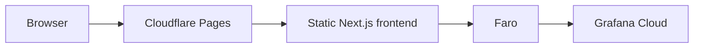
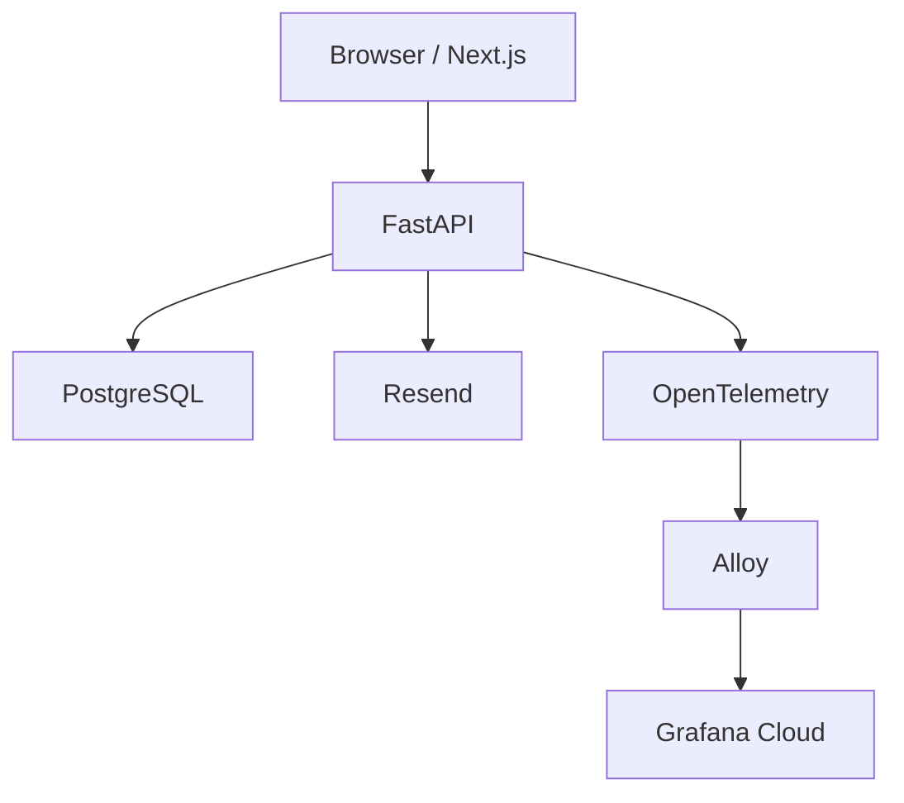
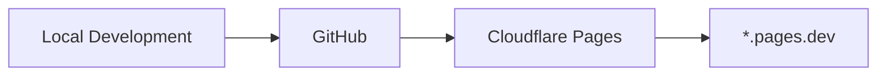
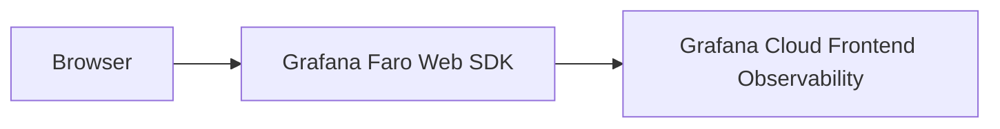
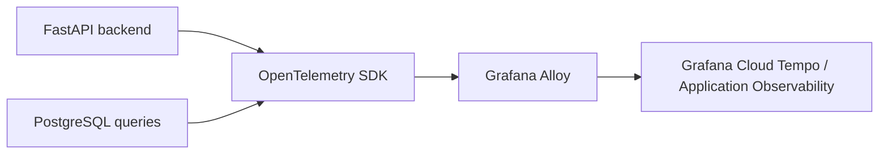

# aldhairmartinez.com (engineering lab)

An evolving hands-on observability and development lab — FastAPI, PostgreSQL, Grafana Alloy, OpenTelemetry, and Grafana Cloud, each piece built and verified for real rather than described in advance.

> **This repository is no longer the production site.** The `aldhairmartinez.com` domain now points to a separate, lightweight production portfolio: [`aldhairmartinez-portfolio`](https://github.com/aldhairmartinez/aldhairmartinez-portfolio) (static Next.js on Cloudflare Pages + a Cloudflare Worker for the contact form). This repo remains a real, working lab — just no longer public-facing at the apex domain. It's still deployed on its own Cloudflare Pages project at its default `*.pages.dev` URL, and is featured as a linked project from the production portfolio.

## What this is

- **A working lab**, not a portfolio anymore — this repo used to serve both roles; the portfolio content and production hosting have moved to the separate repo linked above.
- Real infrastructure and real telemetry (some of it local-only), not a mockup of either. Everything below describes what's actually built here.

The `/observability` route referenced throughout this README only exists in this repo's own local/preview deployments now, not at the production domain.

## Guides

Three learning guides document this lab's progression in depth, one per major version — historical records of what was built and verified at each stage, not living documentation:

1. [V1 — Frontend, Cloudflare Pages, and Faro](docs/01-frontend-cloudflare-faro.pdf)
2. [V2 — FastAPI, OpenTelemetry, Alloy, Tempo, and distributed tracing](docs/02-backend-otel-alloy-tempo.pdf)
3. [V3 — PostgreSQL, persistence, application data, and database-aware tracing](docs/03-postgres-persistence-tracing.pdf)

## Architecture at a glance

Two systems, deliberately kept separate in this README so the distinction is never ambiguous:

**This repo's own deployment** — a fully static site, no backend involved at all, served at this repo's Cloudflare Pages `*.pages.dev` URL (not the `aldhairmartinez.com` domain):



**Local application lab** — real, working, but running only in Docker Desktop on this machine, not reachable by real visitors:



## V1 architecture (frontend — Cloudflare Pages + Faro)

- **[Next.js](https://nextjs.org/)** (App Router) + **React** + **TypeScript** + **[Tailwind CSS](https://tailwindcss.com/)** (v4, CSS-first config)
- **Static export** (`output: 'export'`) — every route is pre-rendered at build time to plain HTML/CSS/JS; no server process and no backend
- **[Cloudflare Pages](https://pages.cloudflare.com/)** for hosting and CI/CD — builds and deploys automatically on every push to `main`, served at this repo's own `*.pages.dev` URL
- **[Grafana Faro](https://grafana.com/oss/faro/)** — frontend instrumentation, sending real browser telemetry to **Grafana Cloud Frontend Observability**
- **MDX-based content** (frontmatter + Markdown) for projects and writing, parsed at build time — no CMS, no database

This was the site's original architecture, and it briefly served the real `aldhairmartinez.com` domain in production. The domain has since moved to the separate [`aldhairmartinez-portfolio`](https://github.com/aldhairmartinez/aldhairmartinez-portfolio) repository (see the note at the top of this README) — V1 as built and described here is unchanged, it just isn't what visitors to the apex domain see anymore.

## V2 architecture (backend, local Docker only — not production-hosted)

- **[FastAPI](https://fastapi.tiangolo.com/)** (Python), running in Docker Desktop, handles the contact form and sends real email through **[Resend](https://resend.com/)** to `hello@aldhairmartinez.com`.
- **OpenTelemetry** instruments FastAPI and its outbound `httpx` calls automatically.
- **[Grafana Alloy](https://grafana.com/docs/alloy/)**, also running locally, relays those traces over OTLP to **Grafana Cloud Tempo / Application Observability**.
- **Distributed trace correlation** — Grafana Faro attaches a W3C trace context header to the contact form's request, and FastAPI continues that same trace rather than starting a new one, producing one continuous trace from browser to backend.
- None of this runs in production yet; production remains the fully static site described above.

## V3 architecture (PostgreSQL data layer, local Docker only)

- **PostgreSQL 18.6**, running in Docker Desktop with a named volume for persistence, reached from FastAPI through a `psycopg` connection pool (`psycopg_pool`) — no ORM, plain SQL.
- **Contact history** — every contact-form submission is persisted (name/email/message, whether the Resend email actually sent, and any delivery error), independent of whether email delivery itself succeeds.
- **Resume download analytics** — anonymous counters for PDF/DOCX downloads (file type + timestamp only, no IP, no user-agent, no personal data).
- **Project view analytics** — anonymous counters for project-page views (slug + timestamp only).
- **Deployment history** — `version`/`commit_sha`/`environment`/`notes`, seeded today from real git history; the write endpoint (`POST /api/deployments`) is protected by a shared-secret header, meant for CI/CD later.
- **OpenTelemetry instrumentation for PostgreSQL** (`opentelemetry-instrumentation-psycopg`) — every query is now its own span, alongside the existing FastAPI/httpx spans, all under the same trace as the browser's request.
- Like V2, none of this is production-hosted — it's a real, working local application lab, not a mockup.

### Deployment flow (this repo)



### Observability flow (frontend, V1)



### Observability flow (local — backend)



## Development

```bash
npm install
npm run dev     # http://localhost:3000
npm run lint
npm run build    # static export → ./out
```

Backend (optional, local only): `docker compose up` — see `backend/` and `alloy/`.

The lab is started manually, on purpose — `docker-compose.yml` deliberately
sets no restart policy on `backend`, `alloy`, or `postgres`. This is an
occasional learning/demo environment, not a continuously running service:
there's no expectation it survives a Docker Desktop restart or a reboot
unattended, and adding `restart: unless-stopped` would fight that intent
rather than serve it. Bring it up with `docker compose up` whenever you
want to use or demo it; there's nothing wrong if it's simply not running
between sessions.

## Environment configuration

Three variables configure Faro:

- `NEXT_PUBLIC_FARO_URL`
- `NEXT_PUBLIC_FARO_APP_NAME`
- `NEXT_PUBLIC_FARO_ENVIRONMENT`

`.env.example` documents every variable the project uses (with placeholder values only) and is committed to Git. `.env.local` holds real local values and is gitignored — it's never committed. Production values are configured directly in the Cloudflare Pages project settings, not in any file in this repository. No collector URLs, credentials, or tokens are ever committed or documented in this README.

The backend and Alloy have their own env files following the same pattern — `backend/.env.example` and `alloy/.env.example` document what each needs (Resend, PostgreSQL credentials, the deployment-history write token, Grafana Cloud OTLP endpoint/credentials); the real values live in gitignored `backend/.env` and `alloy/.env`.

## Observability

V1 is instrumented with Grafana Faro, sending real browser telemetry to Grafana Cloud Frontend Observability. The instrumentation is configured to collect page loads/navigation, frontend (JavaScript) errors, Web Vitals, browser/resource performance timing, and session data.

Verification (originally done while this repo served the real domain) showed page loads for `/` and `/observability`, with TTFB, FCP, LCP, and CLS reported, and zero JavaScript errors in that initial sample. That confirms the pipeline works end to end — it's not a performance benchmark, and the sample is far too small to draw any performance conclusions from.

Session Replay is not implemented yet. Distributed tracing between the browser and the backend is implemented, but only reaches Grafana Cloud while the backend is running locally — see below.

## Current vs. planned

**LIVE — this repo's own Cloudflare Pages deployment (`*.pages.dev`, no longer the custom domain):**
- Static Next.js frontend, no backend
- Cloudflare Pages deployment, HTTPS
- Grafana Faro → Grafana Cloud Frontend Observability

**LIVE — LOCAL (Docker Desktop, not hosted anywhere public):**
- FastAPI backend, OpenTelemetry-instrumented (including PostgreSQL query spans)
- Grafana Alloy, relaying backend traces to Grafana Cloud Tempo / Application Observability
- PostgreSQL — contact history, resume-download analytics, project-view analytics, deployment history
- Browser-to-backend distributed trace correlation (Faro and FastAPI share the same trace ID)
- Resend email delivery for the contact form, routed to `hello@aldhairmartinez.com`

**Roadmap, in intended order:**
- **Redis — next/later.** Only once there's a real caching, performance, or shared-state need.
- **Kafka — later.** Only once there's a real asynchronous/event-processing need.
- **AWS — future lab phase.** Move FastAPI, Alloy, and PostgreSQL into real cloud infrastructure of their own — a lab deployment, not the `aldhairmartinez.com` production portfolio, which intentionally stays a static site (see the note at the top of this README). This phase also adds: GitHub Actions deployment recording (automating what's currently a manual seed), secrets management, a real backend URL, and frontend → backend connectivity beyond localhost.
- **Google Workspace — future.** Turn `hello@aldhairmartinez.com` from a forwarding address into a full mailbox.
- Also still ahead, independent of the above: Grafana Faro Session Replay, synthetic monitoring, k6 load testing against the FastAPI backend, and automated testing (frontend and backend) — none of this repository's code has automated test coverage today; that's a future enhancement, not something this pass addressed.

The backend, Alloy, and PostgreSQL are all real and working today — they're just not hosted anywhere public yet. `/observability` (this repo's own route, at its `*.pages.dev` URL) tracks the same distinction live, kept in sync with the code.

## Repository philosophy

This project evolves incrementally: **build → deploy → observe → document → expand.** Each piece ships as a real, verified addition — instrumented and confirmed working — before the next one starts, rather than being architected in full up front.

## Project structure

```
app/                    Routes (App Router)
  about/                /about
  contact/              /contact
  experience/           /experience
  observability/        /observability — architecture transparency page
  projects/             /projects and /projects/[slug]
  resume/               /resume
  speaking/             /speaking (implemented, not yet linked in nav)
  writing/              /writing and /writing/[slug]
  layout.tsx            Root layout — fonts, nav, footer, Faro init
  page.tsx              Homepage
  sitemap.ts, robots.ts, opengraph-image.tsx

components/
  ui/                   Button, Card, Badge, StatusDot, Container, etc.
  nav/                  Navbar, Footer, mobile menu, social links
  technical/            Grid background, topology graphic, project motifs, cloud icon
  content/              Project/article cards, role timeline, pipeline diagram,
                         production architecture diagram
  analytics/            FaroInit — env-gated frontend instrumentation
  icons/                Hand-rolled GitHub/LinkedIn glyphs (lucide-react
                         dropped brand icons; these are minimal inline SVGs)

content/
  projects/*.mdx        One file per project — typed frontmatter + Markdown
  writing/*.mdx         One file per article — same pattern

lib/
  content.ts            Content loader — frontmatter parsing, Markdown→HTML
  site.config.ts        Centralized name, URLs, social links, nav config
  experience.ts         Career timeline data (drives /experience and /resume)
  status.ts             Status → display metadata (also one-off accent rules)
  cn.ts                 Tiny className-merging helper

backend/                FastAPI application (Docker, local only — not in production)
  main.py               Routes: health checks, /api/contact, analytics, deployments
  telemetry.py          OpenTelemetry setup (FastAPI/httpx/psycopg → Alloy)
  email_client.py       Resend integration
  db.py                 PostgreSQL connection pool + schema application
  schema.sql            Table definitions (idempotent, run on every startup)
  contacts.py           Contact-submission persistence
  analytics.py          Resume-download / project-view analytics
  deployments.py        Deployment history read/write

alloy/                  Grafana Alloy config (Docker, local only)
  config.alloy          OTLP receiver → Grafana Cloud Tempo / Application Observability
```

### Content model

Adding a project or article is a matter of dropping a new `.mdx` file into `content/projects/` or `content/writing/` with frontmatter — no component changes required:

```md
---
title: "Example Project"
summary: "One-line description shown on cards and in <meta> tags."
tags: ["Kubernetes", "OpenTelemetry"]
status: "planned"       # live | in-progress | planned  (articles: published | planned)
date: "2026-01-01"
githubUrl: "https://github.com/..."   # optional
externalUrl: "https://..."            # optional
featured: true                        # optional — shows on homepage
hidden: true                          # optional (articles only) — keeps a
                                       # draft in the content backlog without
                                       # publishing a route for it
---

Body content in standard Markdown, including fenced code blocks.
```

## Contributing

This is a public engineering and observability learning lab, not a project soliciting external feature contributions — but if you spot a bug, a broken link, or an accessibility issue, an issue or PR is welcome.

## License

Code in this repository is licensed under the [MIT License](./LICENSE). Written content — the About/Experience copy, project and article text, resume data, and any personal information — is not covered by that license and isn't licensed for reuse.
